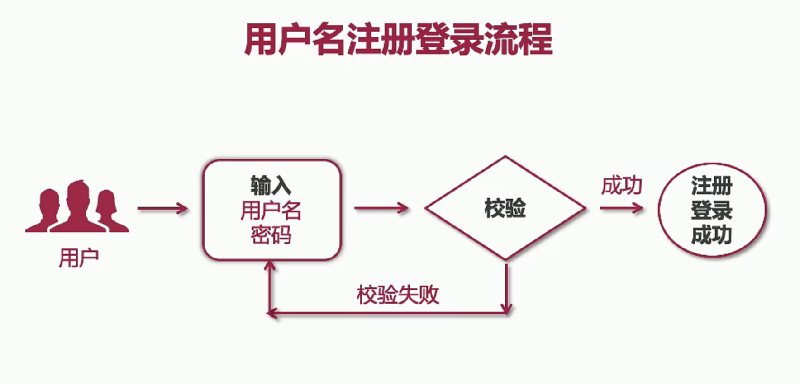
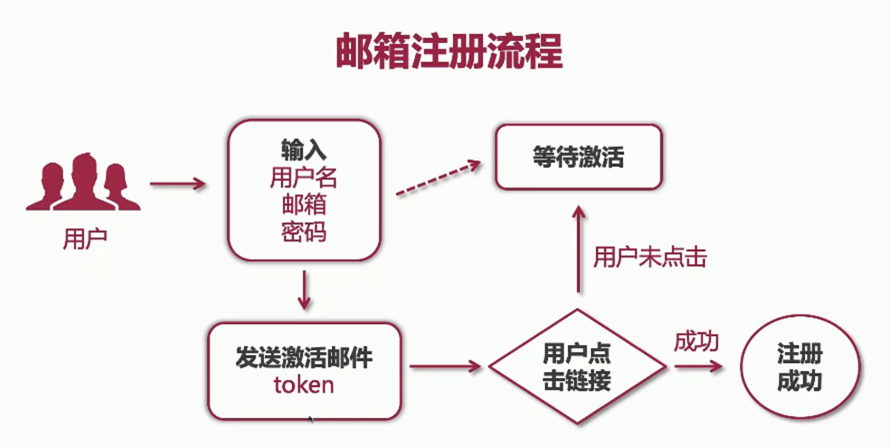
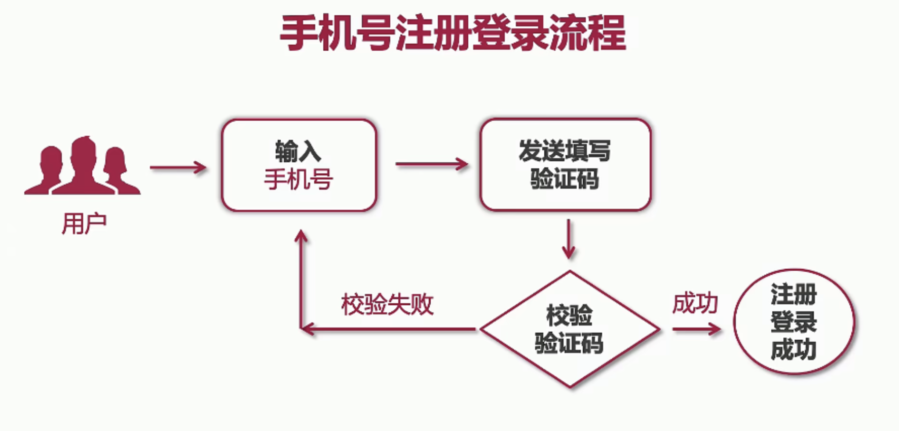

# 实现单体电商项目核心功能
- 用户注册与登录

- Cookie 与 Session

- 集成 Swagger2 API

- 分类设计与实现（商品类别）

- 首页商品推荐

- 商品搜索与分页

- 商品详情与评论渲染

- 购物车与订单（订单的幂等，和库存累减和超卖）

- 微信与支付宝支付

## 用户注册与登录
### 用户注册和登录流程

### 邮箱注册流程

### 手机号注册登录流程

